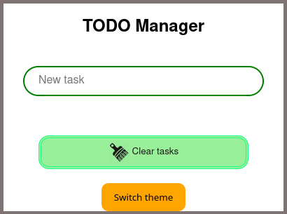

### TODO Manager on HTML ###
My first HTML+CSS+JS project

## Instructions ##
* To add a new task - write it in input form and press Enter 
* To delete tasks - click on it

## Current Features ##
* Save tasks to localStorage and load them every time you open a page.
* Switch between 2 themes: white and dark (dark is kind of ugly for now).
* Change tasks order by dragging them up or down.
* Some pretty animations for deleting tasks.

